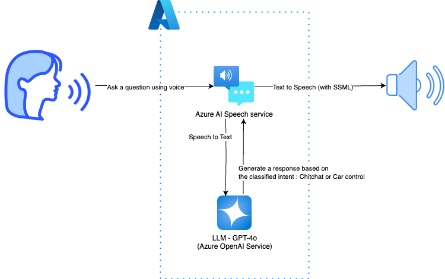

# Voice Agent with Azure OpenAI and Azure AI Speech

This is a sample application that uses Azure AI Speech to interact with the Azure OpenAI Service. The text recognized by the Speech service is sent to Azure OpenAI, where a response is generated based on classified intent. The Speech service then synthesizes speech using SSML (Speech Synthesis Markup Language) from the text response provided by Azure OpenAI. This sample is implemented to receive the entire GPT response (non-text stream), immediately forward its audio chunks, and play them in a streaming audio output.

## Architecture



## Prerequisites

Ensure you have Python installed on your system. This script requires Python 3.10 or higher.

### Setup Azure Resources

- Create an Azure OpenAI Service resource and deploy a model
- Create a Speech resource

## Getting Started

1. Install Dependencies

   Use pip to install the required packages:

   ```sh
   pip install -r requirements.txt
   ```

1. Create .env file

   Copy `.env.template` to `.env` and fill in the necessary values.

1. Start speech recognition from a microphone

   Run the `main.py` script to use Azure AI Speech to converse with Azure OpenAI Service.

   ```sh
   python -m main
   ```
